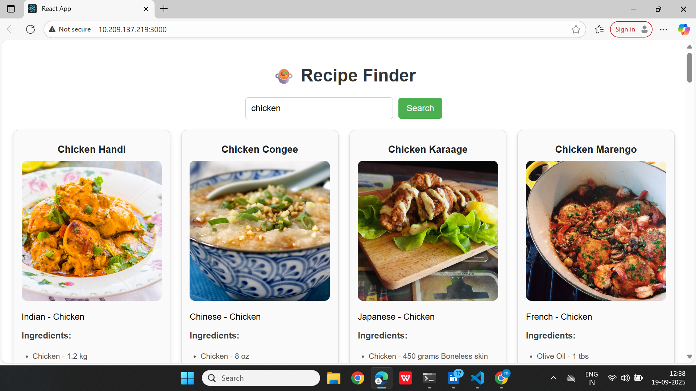

# Getting Started with Create React App

# 🍲 Recipe Finder App

A simple **React application** that lets users search for recipes using [TheMealDB API](https://www.themealdb.com/).  
You can search by **recipe name** or **ingredient**, and it will display recipe details, ingredients, and a link to full instructions.

---

## 🚀 Features
- Search recipes by **name** (e.g., `chicken`)  
- Search recipes by **ingredient** (e.g., `potato`)  
- Displays:
  - Recipe **image & name**
  - **Category** and **Area**
  - **Ingredients with measurements**
  - Link to full recipe / YouTube video
- Responsive card layout (works well on desktop & mobile)

---

## 🛠️ Tech Stack
- **React**  
- **CSS3**  
- **TheMealDB API**

---

## 📂 Project Setup

Clone the repository:
```bash
git clone https://github.com/your-username/recipe-finder.git
cd recipe-finder

Install dependencies:
'''bash
npm install

Run locally:
'''bash
npm start

Build for production:
'''bash
npm run build

## 📸 Screenshot


## 🎥 Demo Video
👉 [Watch Demo](https://drive.google.com/file/d/1glFHN7L7dITfzYRj55w7MS-n1k2kKBrj/view?usp=sharing)

